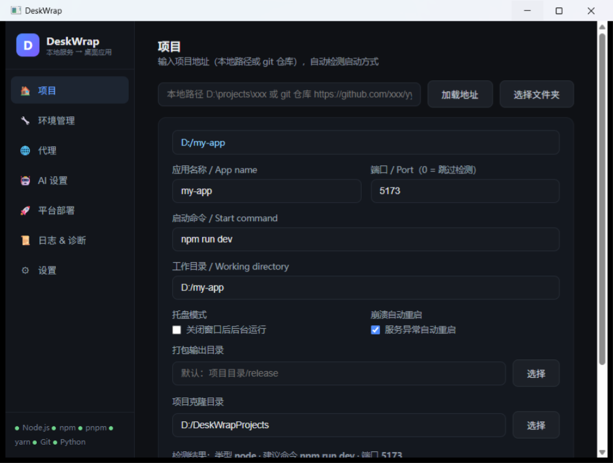
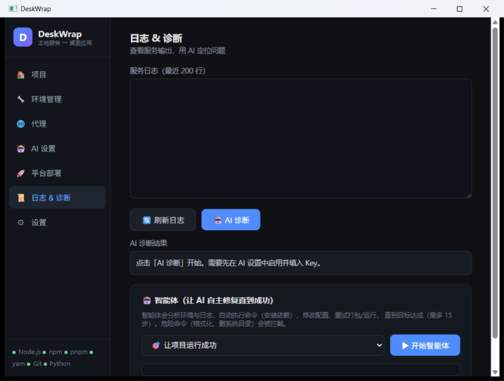

<div align="center">

# 🖥️ DeskWrap

**ローカルの Web サービスを、設定ファイルひとつでネイティブのデスクトップアプリに。ブラウザのタブとはおさらば。**

[English](README.md) | [简体中文](README.zh-CN.md) | 日本語 | [한국어](README.ko.md)

</div>

DeskWrap は**単一の Go 実行ファイル（約 8.5 MB）**です。システムの [WebView2 ランタイム](https://developer.microsoft.com/microsoft-edge/webview2/)（Windows 11 に標準搭載）を使って、`localhost` の Web サービスを本物のデスクトップウィンドウに変えます。Electron も Node の同梱も不要。`deskwrap build` は数秒で完了し、成果物はわずか **5–8 MB の zip**。

AI が生成したプロジェクトに欠けている「最後のワンマイル」：コードはあるのに、依存関係のインストール・起動・ダブルクリックで使えるアプリ化にはターミナル作業が必要です。DeskWrap がそれを代行します——サービスが起動しないときは、内蔵 AI がログを解析して原因を特定し、エージェントが自動修復（依存の導入、ポート変更、設定調整）します。

<div align="center">
  
  
</div>

## 主な機能

- 🧩 **設定駆動** — すべてはひとつの `deskwrap.config.json` に集約
- 🔗 **パスまたは git URL** — ローカルパスやリポジトリ URL を貼るだけ、自動クローン
- 🔍 **自動検出** — Vite / Next.js / Flask / FastAPI / Gradio / Streamlit / Go / pnpm ワークスペース：起動コマンドとポートを自動判定
- 🩺 **レディネスプローブ** — ポートの準備完了を待ち、タイムアウト時はリトライ画面を表示
- 🗑️ **プロセスツリーの後始末** — ウィンドウを閉じるとサービスプロセスツリーを全削除（`taskkill /T /F`、黒いコンソール窓なし）
- 🖥️ **トレイモード** — 閉じてもバックグラウンドで稼働、クラッシュ時は自動再起動
- 🟢 **環境マネージャ** — **自分で入れた**ツールチェーンを使用（Node/npm/pnpm/yarn/Git/Python、nvm/volta/fnm 対応）、ランタイム同梱なし
- 🤖 **AI 診断** — 24 のプロバイダー対応。ログを解析して原因特定と修正案を提示（API キーはローカル保存のみ）
- 🛠️ **エージェントループ** — 「プロジェクトを動かす」：依存導入・ポート/設定修正を自動実行、最大 15 ラウンド、危険コマンドはブロック
- 🌐 **OSS ワンクリック導入** — GitHub / Gitee / HuggingFace / ModelScope / GitLab / Codeberg を検索してワンクリックデプロイ
- 📦 **極小アウトプット** — `build` = exe + 設定 + WebView2Loader.dll をコピーして zip 化、数秒で完了
- 🌍 **日中バイリンガル UI** — zh-CN / en-US、システム言語から自動判定

## クイックスタート

### GUI 版（ダブルクリックだけで、ターミナル不要）

[Releases](https://github.com/yvhcel888/DeskWrap/releases) から `DeskWrap-GUI-2.0.0-win-x64.zip` をダウンロード・解凍し、**DeskWrap-GUI.exe** をダブルクリック：

1. **プロジェクト**パネル → フォルダを選択（または git URL を貼り付け）
2. 起動コマンドとポートが自動入力 → **▶ 実行**でデスクトップウィンドウが開く
3. **📦 ビルド**で数秒のうちに単体アプリの zip を生成

### CLI

```bash
deskwrap init ./my-project   # 設定を対話生成
deskwrap run ./my-project    # デスクトップウィンドウでサービス起動
deskwrap build ./my-project  # パッケージング（exe + 設定 + dll → zip）
deskwrap detect ./my-project # 検出結果を表示
deskwrap gui                 # 管理 GUI を開く
deskwrap help
```

```jsonc
// deskwrap.config.json
{
  "appName": "My App",
  "service": {
    "command": ["node", "server.js"], // ターミナルでの起動方法をそのまま記述
    "cwd": "./my-project",
    "port": 3000                     // レディネスプローブのポート（0 = スキップ）
  },
  "window": { "width": 1280, "height": 800 },
  "tray": false,
  "autoRestart": false
}
```

### ソースからビルド

Go 1.23+ が必要です。

```bash
git clone https://github.com/yvhcel888/DeskWrap.git
cd DeskWrap
go build -ldflags "-s -w" -o deskwrap.exe .
go test ./...   # ユニットテスト
```

## DeskWrap を選ぶ理由

| シチュエーション | 他のツール | DeskWrap |
| --- | --- | --- |
| AI 生成プロジェクトが動かない | エージェント頼み / 手修正 | **AI ログ診断 + エージェント自動修復**（依存・ポート・設定） |
| パッケージサイズ / ビルド時間 | Electron 250MB 超 / Tauri は数分のコンパイル | **5–8MB zip、数秒** |
| 必要なツールチェーン | Tauri は Rust/Cargo、Electron は Node | **ゼロ** — Go の exe ひとつ + システム WebView2 |
| 対象 | 完成サイト / 静的 URL（Pake、nativefier） | **開発中のサービス**——コマンド/ポート自動検出、プロセスツリー管理 |
| OSS プロジェクトの試用 | クローン → 自分で設定 → 手動起動 | **ワンクリック**：検索 → クローン → 検出 → 起動 → パッケージ |

DeskWrap は AI エージェント（opencode / claude-code 系）と**補完関係**にあります：エージェントがコードを**書き**、DeskWrap が**着地**させる（インストール・起動・パッケージング）。このループをつなぐ MCP/CLI ブリッジをロードマップに予定しています。

全体像は [ROADMAP.md](ROADMAP.md) を参照。

## リポジトリ構成

```
deskwrap/
├── main.go / cli.go          # CLI ディスパッチ（init/run/build/detect/gui）
├── proc_windows.go           # Windows コア：cmd shim 直接起動・黒窓なし・プロセスツリー後始末・UTF-8→ACP デコード
├── detect.go                 # プロジェクト自動検出
├── agent.go                  # AI プロバイダー + エージェントループ
├── gui_windows.go            # WebView2 ウィンドウ + トレイ + deskwrap.* API ブリッジ
├── assets/gui.html           # 7 パネル管理 GUI
├── tools/                    # 開発・診断ツール
├── docs/screenshots/         # README 用スクリーンショット
└── main_test.go              # ユニットテスト
```

## ロードマップ

[ROADMAP.md](ROADMAP.md) を参照。重点は **自動検出 + プロセスツリー管理 + AI 修復ループ**、その後にエージェントエコシステム連携（MCP/CLI）、テンプレート、macOS/Linux ネイティブウィンドウ。

## 謝辞

[go-webview2](https://github.com/jchv/go-webview2) · [WebView2 ランタイム](https://developer.microsoft.com/microsoft-edge/webview2/) · [systray](https://github.com/getlantern/systray) · 各オープンソースプラットフォーム、そしてデスクトップアプリ化されたすべてのプロジェクトに感謝します。

## ライセンス

[MIT](LICENSE)
